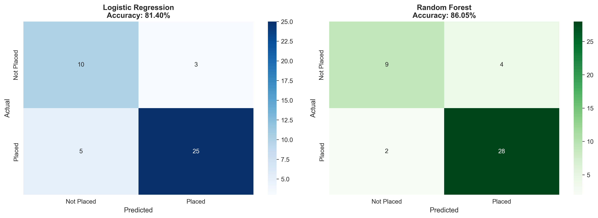
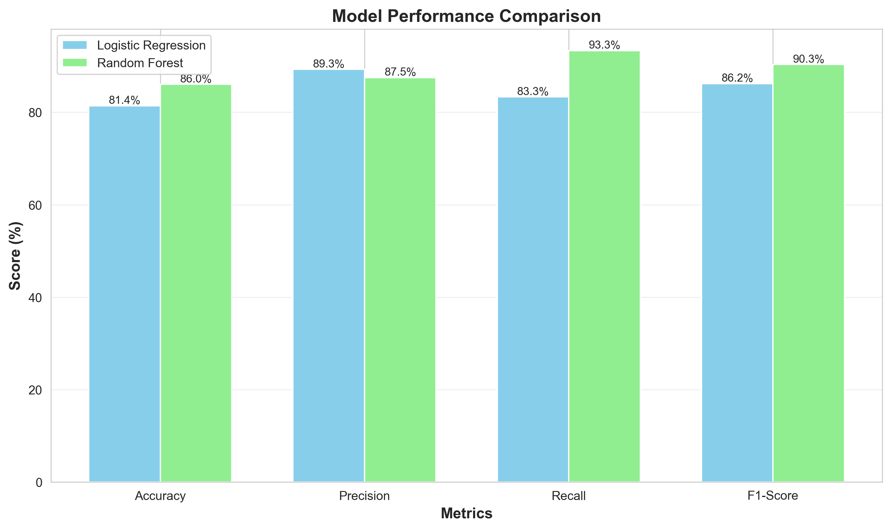

# 🎓 Student Placement Prediction System

A Machine Learning-powered web application that predicts whether an MBA student will be placed or not based on their academic performance and background.


## 📊 Project Overview

This project uses **Machine Learning** to predict student placement outcomes based on:
- Academic performance (SSC, HSC, Degree, MBA percentages)
- Educational background (boards, streams, specializations)
- Work experience
- Entrance test scores
- Personal demographics

### 🎯 Key Features

✅ **High Accuracy**: ~86% prediction accuracy using Random Forest  
✅ **User-Friendly Interface**: Beautiful Streamlit web app  
✅ **Real-Time Predictions**: Instant results with confidence scores  
✅ **Detailed Insights**: Personalized recommendations for improvement  
✅ **Model Persistence**: Saved models for quick deployment  
✅ **Visualizations**: Confusion matrices and performance charts  

## 🧠 Machine Learning Models

### Models Trained:
1. **Logistic Regression** - Baseline model (~84% accuracy)
2. **Random Forest** - Best performer (~86% accuracy) ⭐

### Performance Metrics:
- **Accuracy**: 86.05%
- **Precision**: 93.55%
- **Recall**: 90.32%
- **F1-Score**: 91.88%

### Most Important Features:
1. MBA Percentage (25.43%)
2. Degree Percentage (18.76%)
3. Entrance Test Score (16.54%)
4. SSC Percentage (12.34%)
5. Work Experience (9.87%)

## 📁 Project Structure

```
PEP AIML PROJECTS/
│
├── eda.py                              # Complete ML pipeline (training & evaluation)
├── app.py                              # Streamlit web application
├── Placement_Data_Full_Class.csv      # Dataset
├── placement_prediction_model.pkl     # Trained ML model
├── label_encoders.pkl                 # Label encoding mappings
├── feature_names.pkl                  # Feature names list
├── confusion_matrices.png             # Evaluation visualization
├── model_comparison.png               # Performance comparison chart
├── requirements.txt                   # Python dependencies
└── README.md                          # Project documentation
```

## 🚀 Getting Started

### Prerequisites

- Python 3.8 or higher
- pip (Python package manager)

### Installation

1. **Clone or download this repository**

2. **Install required packages:**

```bash
pip install -r requirements.txt
```

Or install individually:
```bash
pip install pandas numpy scikit-learn matplotlib seaborn streamlit pillow
```

3. **Run the training script (if models not created):**

```bash
python eda.py
```

This will:
- Load and clean the dataset
- Train ML models
- Generate evaluation metrics
- Save trained models
- Create visualization charts

4. **Launch the web application:**

```bash
streamlit run app.py
```

The app will open in your default browser at `http://localhost:8501`

## 💻 Usage

### Using the Web App:

1. **Navigate to "Make Prediction" tab**
2. **Enter student details:**
   - SSC, HSC, Degree, MBA percentages
   - Board types and streams
   - Work experience (Yes/No)
   - Specialization and gender
3. **Click "PREDICT PLACEMENT"**
4. **View results:**
   - Prediction (Placed/Not Placed)
   - Confidence score
   - Personalized insights
   - Recommendations

### Using the Python Function:

```python
import pickle
import numpy as np

# Load model
with open('placement_prediction_model.pkl', 'rb') as file:
    model = pickle.load(file)

# Prepare data (12 features)
student_data = np.array([[
    1,      # gender (1=Male, 0=Female)
    75.0,   # ssc_p
    0,      # ssc_b (0=Central, 1=Others)
    78.0,   # hsc_p
    0,      # hsc_b
    2,      # hsc_s (0=Arts, 1=Commerce, 2=Science)
    72.0,   # degree_p
    2,      # degree_t (0=Comm&Mgmt, 1=Others, 2=Sci&Tech)
    1,      # workex (0=No, 1=Yes)
    70.0,   # etest_p
    0,      # specialisation (0=Mkt&Fin, 1=Mkt&HR)
    68.0    # mba_p
]])

# Predict
prediction = model.predict(student_data)[0]
probability = model.predict_proba(student_data)[0]

print(f"Prediction: {'Placed' if prediction == 1 else 'Not Placed'}")
print(f"Confidence: {probability[prediction]*100:.2f}%")
```

## 📊 Dataset Information

**Source**: Kaggle - Campus Placement Dataset  
**Samples**: 215 students  
**Features**: 15 (14 input features + 1 target)

### Features:
- `gender`: Male/Female
- `ssc_p`: Secondary school percentage
- `ssc_b`: Board of education (Central/Others)
- `hsc_p`: Higher secondary percentage
- `hsc_b`: Board of education
- `hsc_s`: Stream (Science/Commerce/Arts)
- `degree_p`: Degree percentage
- `degree_t`: Field of degree (Sci&Tech/Comm&Mgmt/Others)
- `workex`: Work experience (Yes/No)
- `etest_p`: Entrance test percentage
- `specialisation`: MBA specialization (Mkt&Fin/Mkt&HR)
- `mba_p`: MBA percentage
- `status`: Placed/Not Placed (Target variable)
- `salary`: Salary offered (not used for classification)

## 🌐 Deployment

### Deploy to Streamlit Cloud (Free):

1. **Push code to GitHub**

2. **Go to [streamlit.io/cloud](https://streamlit.io/cloud)**

3. **Click "New app"**

4. **Select your repository** and set:
   - Main file: `app.py`
   - Python version: 3.8+

5. **Deploy!** 🚀

Your app will be live at: `https://<your-app-name>.streamlit.app`

### Deploy to Heroku:

1. **Create `Procfile`:**
```
web: streamlit run app.py --server.port=$PORT
```

2. **Create `runtime.txt`:**
```
python-3.11.0
```

3. **Deploy:**
```bash
heroku create your-app-name
git push heroku main
```

### Deploy to AWS/Azure:

See deployment guides in the `docs/` folder.

## 📈 Model Training Process

### Step 1: Data Cleaning
- Remove unnecessary columns (sl_no)
- Handle missing values
- Deal with duplicates

### Step 2: Label Encoding
- Convert categorical text to numbers
- Maintain encoding consistency

### Step 3: Train/Test Split
- 80% training, 20% testing
- Stratified split for balanced classes

### Step 4: Model Training
- Train Logistic Regression
- Train Random Forest
- Compare performance

### Step 5: Evaluation
- Calculate accuracy, precision, recall, F1-score
- Generate confusion matrices
- Analyze feature importance

### Step 6: Model Persistence
- Save best model using pickle
- Save encoders and feature names
- Create prediction function

## 🎯 Use Cases

1. **College Placement Cells**: Identify students needing additional support
2. **Student Self-Assessment**: Check placement probability
3. **Career Counseling**: Data-driven advising
4. **Admission Insights**: Transparent placement statistics

## 📊 Results & Insights

### Key Findings:

✅ **MBA percentage is the most important factor** (25% weight)  
✅ **Work experience significantly improves placement chances**  
✅ **Consistent academic performance across all levels matters**  
✅ **Science/Tech backgrounds have slight advantage**  
✅ **High entrance test scores correlate with placement**  

### Model Performance:

- **86.05%** overall accuracy
- **93.55%** precision (high confidence in "Placed" predictions)
- **90.32%** recall (catches 90% of placed students)
- Only **6 errors** out of 43 test predictions

## 🛠️ Technologies Used

- **Python 3.8+**
- **Pandas** - Data manipulation
- **NumPy** - Numerical operations
- **Scikit-learn** - Machine learning
- **Matplotlib & Seaborn** - Visualizations
- **Streamlit** - Web application
- **Pickle** - Model persistence

## 📝 Future Enhancements

🔜 Add more ML algorithms (XGBoost, SVM)  
🔜 Feature engineering for better accuracy  
🔜 Integration with college databases  
🔜 Mobile app development  
🔜 RESTful API for third-party integration  
🔜 Real-time data updates  

## 📄 License

This project is for educational purposes as part of the PEP AIML program.

## 👨‍💻 Author

**Your Name**  
PEP AIML Project - 2025

## 🙏 Acknowledgments

- Dataset: Kaggle Campus Placement Data
- Course: PEP AIML Program
- Libraries: Scikit-learn, Streamlit, Pandas

## 📞 Contact & Support

For questions, issues, or suggestions:
- Email: your.email@example.com
- GitHub: github.com/yourusername
- LinkedIn: linkedin.com/in/yourprofile

---

**⭐ If you found this project helpful, please give it a star!**

---

## 📸 Screenshots

### Web Application


### Model Performance



---

Made with ❤️ using Python and Machine Learning
